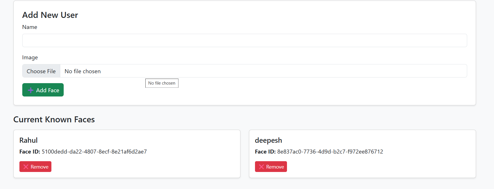

# 🔔 Smart Doorbell with Face Recognition

A Python-powered smart doorbell system that captures live video, detects and recognizes known faces using AWS Rekognition, and sends real-time alerts via email and SMS. Includes a web dashboard to manage known visitors and log every entry with a snapshot.

---

## ✨ Features

- 🎥 Real-time video feed via OpenCV
- 🧠 Face recognition with AWS Rekognition
- 📬 Email alerts via Gmail
- 📲 SMS alerts via Twilio
- 🖼️ Visitor snapshot logging
- 🌐 Web dashboard to manage users
- 🔒 Environment-based secret handling

---

## 🧰 Tech Stack

- Python 3.8+
- OpenCV
- Flask
- AWS Rekognition
- Twilio SMS
- Gmail SMTP
- dotenv

---

## 🗂️ Project Structure

smart-doorbell/
├── app/
│ ├── aws_rekognition.py
│ ├── config.py
│ ├── notification.py
│ ├── sms_alert.py
│ ├── visitor_log.py
├── logs/
│ └── visitor_log.json
│ └── snapshots/
├── static/
│ └── uploads/
│ └── snapshots/
├── templates/
│ ├── index.html
│ └── manage_users.html
├── dashboard.py
├── run.py
├── .env # Not tracked — for credentials
├── requirements.txt
├── README.md

---

## 🔧 Setup Instructions

1. **Clone the repo**

git clone https://github.com/yadavdeepesh07/smart-doorbell-face-recognition.git
cd smart-doorbell-face-recognition

2. Create a virtual environment
python -m venv venv
venv\Scripts\activate      # Windows
source venv/bin/activate   # macOS/Linux
3. Install dependencies
pip install -r requirements.txt
4. Create a .env file with your AWS Rekognition and Gmail SMTP credentials
# AWS
AWS_ACCESS_KEY_ID=your_key
AWS_SECRET_ACCESS_KEY=your_secret
AWS_REGION=us-east-1

# Email
EMAIL_ADDRESS=your_email@gmail.com
EMAIL_PASSWORD=your_app_password

# Twilio
TWILIO_ACCOUNT_SID=your_sid
TWILIO_AUTH_TOKEN=your_token
TWILIO_PHONE=+1234567890
USER_PHONE=+919xxxxxxxxx
5. Run the 
    1. Live Face Detection & Alerts
    python run.py
    2. Launch Web Dashboard
    python dashboard.py

Screenshots

Security Notes
✅ Never commit .env or real credentials

✅ AWS keys are required only for face recognition, not for UI

✅ GitHub blocks pushes with leaked secrets

🧠 Credits
AWS Rekognition

Twilio

OpenCV

Flask
